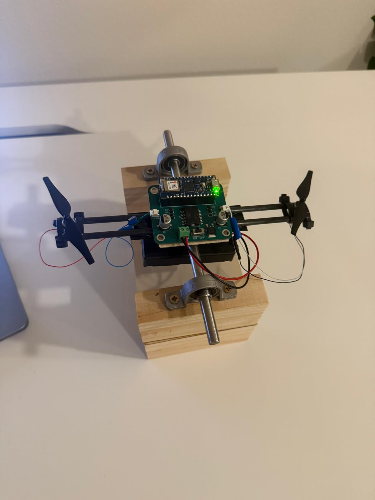
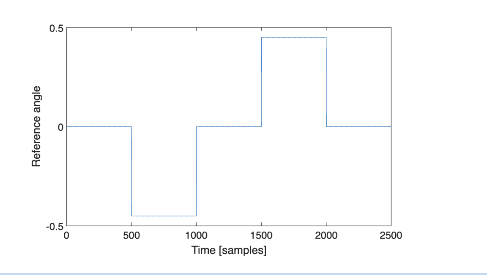

# Self-Balancing Bicopter (Simulink + Arduino Nano 33 IoT)

## Overview
This project implements a self-balancing **bicopter** using **Model Predictive Control (MPC)** designed in **Simulink** and deployed to an **Arduino Nano 33 IoT**.

## Workflow
1. **Open-loop experiments (TCP):** Run an open-loop model to collect input–output data over TCP.
2. **System identification:** Use MATLAB’s **System Identification Toolbox** to estimate a **state-space model** (A, B, C, D) of the vehicle.
3. **Closed-loop MPC:** Using the identified plant, design a **closed-loop MPC** (Model Predictive Control Toolbox) that drives the motors via PWM and **tracks reference trajectories**—for example, a pitch-angle θ(t) step or time profile—on hardware.

## Deployment
Deployment uses the **Simulink Support Package for Arduino Hardware**. MATLAB scripts provide TCP-based input/output logging for identification and validation.

## Stack & Requirements
- MATLAB/Simulink (R2023b+ recommended)
- System Identification Toolbox
- Model Predictive Control Toolbox
- Simulink Support Package for Arduino Hardware
- Matlab Support Package for Arduino Hardware
- Arduino Nano 33 IoT (NINA-W10)
- Motors (PWM-driven)
- Custom Made PCB Board
- USB data cable
- Hardware (miscellaneous)

*Figure 1 — Bicopter prototype on test stand (Nano 33 IoT + custom PCB).*

*Figure2 — Time θ(t) in radians we want bicopter to follow with Closed Loop MPC controller.*

*Figure3 — Self-balancing bicopter (MPC) tracking θ(t).*
